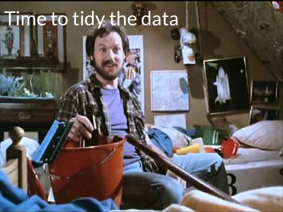

```{r setup, include= FALSE, echo = FALSE, warning=FALSE}
library(kableExtra)
source("cleaning_aoic.R")

```
<script src="https://ajax.googleapis.com/ajax/libs/jquery/3.3.1/jquery.min.js"></script>
<script>
$(document).ready(function(){
    $('[data-toggle="popover"]').popover(); 
});
</script>

 
# Executive Summary

* The department should invest staffing resources into a Data, Research, and Visualization.

* This unit will collect, clean, analyze, and present data to ensure the department is data-drive, thereby maximizing the investment in *CFive Supervisor.*

* This unit would use already available tools, including [Office 365](https://products.office.com/en-us/business/office) and [R](https://www.r-project.org), to maximize the return on *CFive Supervisor.*

* This unit would collapse existing resources to:

  * Prepare for [CFive's Supervisor](https://www.cfive.com/products/supervisor/)'s data collection and dashboards featuers
  
  * Work with the [Cook County Geographic Information Systems Department](https://www.cookcountyil.gov/agency/geographic-information-systems-gis-0) to create new, data driven tools. 
  
---
# Unit Mission Statement
*It is the policy of the Cook County Juvenile Probation and Court Services Department to maintain the highest level of data integrity within the department and with community partners and to use this data to develop polices, procedures, and programs that enhance the possibility of long term success for all young people under the care of the court.*

---
# Specific Recommendations

* At a minimum, a system administrator is needed to ensure *Supervisor's* data integrity.

* More resources would allow for more insights including

  * Redesigning all forms and reports
  
  * [Developing GIS solutions](https://www.cookcountyil.gov/agency/geographic-information-systems-gis-0)
  
---
# Unit Structure
.center[
.pull-left[]

.pull-right[

* Two support professionals 

* The CFive System Administrator

* Program managing officers
]]
---

# Unit Responsibilties

* Collect, clean, and store data

* Assist the department in evaluating program effectiveness

* Maintaining and leverage all of Department's data sharing agreements

* Expand the development of CFive's reporting and data visiulization capabilities

* It is not a revolutionary change, simple an evolution of the departments capabilities and opportunities

* A Data, Research, and Visualization Unit solves the *mission critical* need of evidenced based practices

---
# AOIC Stats as an Example

Consider the current AOIC report, presented in the following format:

```{r first_8, include = TRUE, echo = FALSE}

first_eight <- head(June[ , 1:8])

first_eight %>% 
  kable( format = "html") %>%
  kable_styling(bootstrap_options = c("bordered", "responsive", "condensed "))

``` 

The first of the eight columns contain the DCPO, SPO, and police district. 

The remaining colums contain the PO's case load data.
---
# Columns Nine Through Eleven: 
## Aggregates

```{r 9_11, include = TRUE, echo = FALSE}
kable(head(June[ , 9:11]), caption = "Caseload Aggregate Data") %>%
  kable_styling("striped")
```

Calculated values, computed rowise, tally caseload totals and averages.
---
# VOP and Caseload Averages
```{r 12-19, include = TRUE, echo = FALSE}
kable(head(June[ , 13:19])) %>%
  kable_styling(bootstrap_options = c("striped", "condensed", "responsive"), font_size = 16)  
```

The remaining columns are a combination of unit, division, and department wide data used for baseline comparision.

---
# Issues with this format:

* Storing and presenting AOIC data in this fashion limits additional investigation of the data. 

  * Multiple spreadsheets must be created and merged in order to do month-month comparisons. 

  * Compiling said spreadsheets increases the chances of errors:
      * Due to spelling mistakes
      * Accidentally deleting spreadsheet structure
      * Over-writing spreadsheets while saving them.
      
* Excel does not become a website or a slide presentation easily
  
---
# CFive's Eventual Solution

* [CFive's Supervisor](https://www.cfive.com/products/supervisor/) will be able to solve most of these data collection issues. 

* As of the current understanding of the Statement of Work, *Supervisor* will pull these necessary numbers from the system as a standard report.

* Unfortunately, the reporting features are not completed nor are they available for preview. 

---
# The Solution: Tidy Data

* Implementing [tidy data](http://vita.had.co.nz/papers/tidy-data.html) is the first step in the transformation of data-driven office. 

* Tidy data is short hand for:

    * Columns are single variable
    * Rows are single observation
    * Each observational unit forms a table

.center[]

---
# AOIC Revisited
## This document violates all of the rules of tidy data.
 
```{r aoic_highlighted, include = TRUE, echo=FALSE}

head(June[,1:11], n = 10) %>% 
  mutate(X__1 = cell_spec(X__1, 
                          popover = spec_popover(content = "Column contains multiple variables",
                                                       position = "top")),
         X__2 = cell_spec(X__2,
                          popover = spec_popover(content = "PO Donnelly",
                                                 position = "top")),
         X__3 = cell_spec(X__3,
                          popover = spec_popover(content = "PO Korte",
                                                 position = "top")),
         X__4 = cell_spec(X__4,
                          popover = spec_popover(content = "PO Malave",
                                                 position = "top")),
         X__5 = cell_spec(X__5,
                          popover = spec_popover(content = "PO O\\'Rourke",
                                                 position = "top")),
         X__6 = cell_spec(X__6,
                          popover = spec_popover(content = "PO Pulido",
                                                 position = "top")),
         X__7 = cell_spec(X__7,
                          popover = spec_popover(content = "SPO Bufano",
                                                 position = "top")),
         X__8 = cell_spec(X__8,
                          popover = spec_popover(content = "Blank column to force formatting",
                                                 position = "top")),
         X__9 = cell_spec(X__9,
                          popover = spec_popover(content = "Caseload Total should be computed number on a seperate page.",
                                                 position = "top")),
         X__10 = cell_spec(X__10,
                          popover = spec_popover(content = "Caseload Average, per unit, is also a computed number that should be calculated and displayed elsewhere.",
                                                 position = "top")),
         
         ) %>%
  kable(escape = FALSE) %>%
  kable_styling(bootstrap_options = c("condensed", "hover"), font_size = 16) %>%
  scroll_box(width = "720px", height = "425px")


```

---
## AOIC Stats: Tidy Review

* POs are not variables
  * They track observations
  * Therefore, POs should be Rows
  
* Columns contain have multiple units

* Calculated figures, while not necessarily messy, are neither variables or observations
---

## GBO As a Demo

For example, consider the GBO[^1] unit.

```{r gbo_demo, include=TRUE, echo = FALSE}
cal_55_2 %>% 
  kable(booktabs = TRUE, format = "html", caption = "September, 2018") %>%
  kable_styling(bootstrap_options = c("condensed", "hover"), font_size = 16) %>%
  scroll_box(width = "720px", height = "425px")


```

---
### GBO Continued

* Individual stats are clear
* Especially if columns are limited to PO data
* Adding an additional unit,the issue with messy data becomes apparent

---
## GBO and Lawndale[^2]

```{r GBO_and_Lawndale, include=TRUE, echo = FALSE}
cal_55_2 %>% 
  bind_rows(cal_57) %>%
  kable(booktabs = TRUE, format = "html", caption = "GBO and Lawndale: September, 2018") %>%
  kable_styling(bootstrap_options = c("condensed", "hover"), font_size = 16) %>%
  scroll_box(width = "720px", height = "425px")
```

---
### GBO and Lawndale Continued

* Multiple POs per Column

* Individuals stas are duplicated

  * In this format, stas are duplicated with each unit
  
* Intra-unit stas are easy to read

* Inter-unit stats become more difficult
  * Each unit adds dramatically to this difficult
  
---
# GBO, Lawndale, and 8
```{r GBO_Lawndale_and_53, include=TRUE, echo = FALSE}
cal_55_2 %>% 
  bind_rows(cal_57) %>%
  bind_rows(cal_53) %>%
  kable(booktabs = TRUE, format = "html", caption = "GBO, Lawndale, and 8th District: September, 2018") %>%
  kable_styling(bootstrap_options = c("condensed", "hover"), font_size = 16) %>%
  scroll_box(width = "720px", height = "425px")
```

---
# New Format
The solution looks like this:

```{r tidy, include=TRUE, echo = FALSE, message = FALSE}
  cal_55_2 %>% 
    tidy_up() %>% 
    kable(booktabs = TRUE, format = "html", caption = "GBO: September, 2018") %>%
  kable_styling(bootstrap_options = c("condensed", "hover"), font_size = 16) %>%
  scroll_box(width = "720px", height = "425px")

```
---
## New Format: Pros and Cons

.pull-left[
### Cons
* It is difficult to read a 17-column[^2] wide table
  *   Scroll bars make it tolerable
  *   Paper requires changing layout and font size
  *   PDFs can allow for "zooming in" to focus on particular items
]

.pull-right[
* Tidy format allows for faster selction of specific variables
* Filtering for specific observations is faster
* Computed variables (averge, total number of POs) can be done by the software
]

---
## New Format: Visualizations

```{r yasi, include=TRUE, echo=FALSE, message = FALSE}
cal_55_2 %>%
  tidy_up() %>% 
  select(1, High = `YASI HIGH`, Mod = `YASI MOD`, 
         Low = `YASI LOW`, Unclassified = `YASI UNCLASSIFIED`) %>%
  rowwise() %>%
  mutate(Total = sum(Low, Mod, High, Unclassified)) %>%
  kable(booktabs = TRUE, format = "html", caption = "GBO: September, 2018") %>%
  kable_styling(bootstrap_options = c("condensed", "hover"), font_size = 16) %>%
  scroll_box(width = "720px", height = "425px")
```

---
## Sorted by Risk

```{r tidy_2, include=TRUE, echo = FALSE, message = FALSE}

lloyd <-  cal_55_2 %>% 
    tidy_up() 

cal_57 %>%
  tidy_up() %>%
  bind_rows(lloyd) %>% 
  select(1:15) %>%
  arrange(desc(`YASI HIGH`)) %>%
  kable(booktabs = TRUE, format = "latex", caption = "GBO and Lawndale by High Risk: September, 2018") %>%
  kable_styling(bootstrap_options = c("condensed", "hover"), font_size = 16) %>%
  scroll_box(width = "720px", height = "425px")

```

---

Crowding all of the columns onto one page is not ideal; however, one can easily see all of the stats by unit for a given month. Filtering by case load stats becomes exceptionally easier:[^4]
---

```{r gbo_lawndale_caseloadstats, include=TRUE,echo=FALSE, message = FALSE}
lloyd <-  cal_55_2 %>% 
    tidy_up() 

cal_57 %>%
  tidy_up() %>%
  bind_rows(lloyd) %>%
  select(1, Unit, High = `YASI HIGH`, Mod = `YASI MOD`, 
         Low = `YASI LOW`, Unclassified = `YASI UNCLASSIFIED`) %>%
  rowwise() %>%
  mutate(Total = sum(Low, Mod, High, Unclassified)) %>%
  arrange(desc(Total)) %>%
  kable(booktabs = TRUE, format = "latex", caption = "Case Totals, Lawndale and GBO: September, 2018") %>%
  kable_styling(bootstrap_options = c("condensed", "hover"), font_size = 16) %>%
  scroll_box(width = "720px", height = "425px")
```

---

## R Markdown: Better Tools for Plots and Graphs
* This work is done in `R and R Markdown`. 
* Like Excel, these tools can create graphs and charts

```{r initial_graphs, include = TRUE, echo = FALSE, fig.cap= "GBO and Lawndale, September 2018", out.height="90%", out.width="90%", out.extra="", fig.pos="h"}

lloyd <-  cal_55_2 %>% 
    tidy_up() 

cal_57 %>%
  tidy_up() %>%
  bind_rows(lloyd) %>% 
  select(1:14) %>%
  gather(2:14, key ="AOIC Stats", value = Totals) %>%
  ggplot(aes(x = PO_Name, y = Totals, fill = `AOIC Stats`)) + 
  geom_bar(stat = "identity", position = "dodge") +
  viridis::scale_fill_viridis(discrete = TRUE) +
  labs(title = "All AOIC StatsGBO and Lawndale, September 2018", 
       x = "PO Name", y = "Client Totals") +
  coord_flip()

```

---

And unlike Excel, these tools easily lends itself to additional visualizations, such as filtering results to focus on specific variables, such as Social Investigations and VOPs Filed. In the following example, the background code is included to show how this work is done.

First as a chart:

```{r as_chart, include = TRUE, echo = TRUE}
cal_57 %>%
  tidy_up() %>%
  bind_rows(lloyd) %>% 
  select(1, `Social Investigation` =`Social investigation`,
         `VOP` = `VOP Filed`) %>% 
  filter(`Social Investigation` > 0 | VOP > 0) %>%
  kable(booktabs = TRUE, format = "latex", 
        caption = "GBO: September, 2018") %>%
  kable_styling(bootstrap_options = c("condensed", "hover"), font_size = 16) %>%
  scroll_box(width = "720px", height = "425px")
```

And as a graph:
---
```{r SI_VOP, include= TRUE, echo = TRUE, fig.cap="Socials and VOPs in GBO and Lawndale"}

lloyd <-  cal_55_2 %>% 
    tidy_up() 

cal_57 %>%
  tidy_up() %>%
  bind_rows(lloyd) %>% 
  select(1, `Social Investigation` =`Social investigation`, 
         `VOP` = `VOP Filed`) %>%
  gather( c(`Social Investigation`, `VOP`), key = Social_VOP, 
          value = Totals) %>%
  ggplot(aes(x = PO_Name, y = Totals, fill = `Social_VOP`)) + 
  geom_bar(stat = "identity", position = "dodge") +
  viridis::scale_fill_viridis(discrete = TRUE, name = "Socials and VOP") +
  labs(title = "GBO and Lawndale, September 2018",
       x = "PO Name", y = "Client Totals") +
  coord_flip()
```

In both of the previous examples, snippets of code were included in the document to showcase how `R` handles filtering. What makes this method superior to Excel is that the above code can be reused with a similar data set. For instance, plotting the same AOIC stas with Markham North:
---
```{r, markham_north, include = TRUE, echo = TRUE, fig.cap = "Socials and VOPs in Markham North", fig.pos = "h"}

cal_mark_n %>%
  tidy_up() %>% 
  select(1, `Social Investigation` =`Social investigation`, 
         `VOP` = `VOP Filed`) %>%
  gather( c(`Social Investigation`, `VOP`), key = Social_VOP, 
          value = Totals) %>%
  ggplot(aes(x = PO_Name, y = Totals, fill = `Social_VOP`)) + 
  geom_bar(stat = "identity", position = "dodge") +
  viridis::scale_fill_viridis(discrete = TRUE, name = "Socials and VOP") +
  labs(title = "Markham North, September 2018",
       x = "PO Name", y = "Client Totals") +
  coord_flip()
```
---
With Excel, each month need to be recalculated from the specific sheet. With `R`, the code can be reused with limited changes. Furthermore, if additional verbiage was required to provide context for a visualization, one would have to export into Word to write the document. With R, one writes the code and the context in the same document, which can significantly improve workflow.
---
## Shiny
With additional resources, specifically installing free software on a the Chief Judge's server, the department would be able to run these same reports internally as a website. This software, known as [Shiny](https://shiny.rstudio.com), would allow us to create dashboards and programmable reports that can updated quickly. Additional examples of how Shiny can be used can be found [here.](https://shiny.rstudio.com/gallery/)
---
# GIS
The award winning Cook County Geographic Information Systems department is willing to develop a number of dashboard and applications for the court. If a Data, Research, and Visualization unit was created, this uni would be able to build internal capacity to utilize GIS tools to go beyond the aforementioned dashboards. Even if the extent of the work was limited to using the GIS tools to turn addresses into latitude and longitude, this would allow for the unit to create regular programmable reports, such as unit level heat maps of risk levels or neighborhood "hot spots." Creating a unit to facilitate all of the department's Data needs, including the tool of GIS, can extend the viability and utility of the CFive investment.
---

[^1]: On the standard AOIC spreadsheet, GBO's stats are between rows 401 and 418.
[^2]: On the standard AOIC spreadsheet, Lawndale's rows 201-218.
[^3]: The columns are: *`r names(cal_55_2 %>% tidy_up()) %>% as.vector()`*
[^4]: Please note the spelling errors come from excel and not the code written in this document.